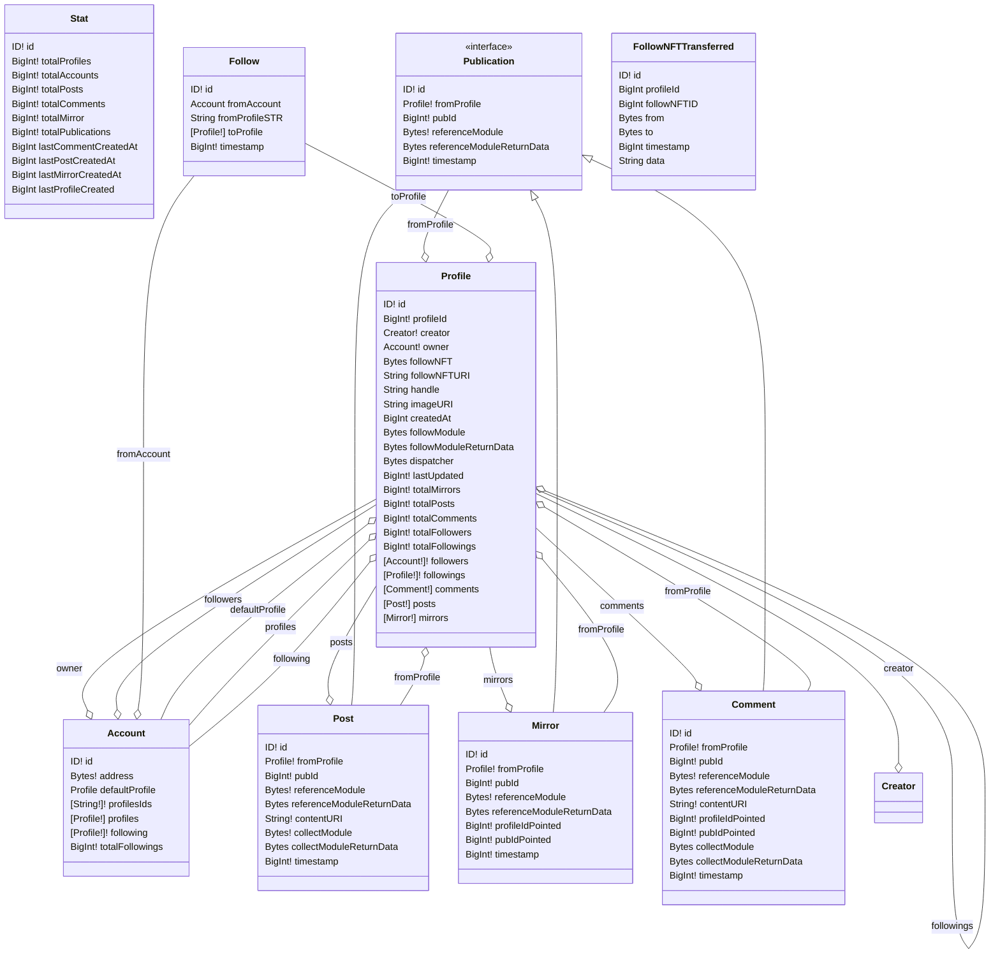

# RTU-Connect
A Decentralized Social Media Platform for Rizal Technological University using Blockchain Technology

```mermaid
classDiagram
class Stat {
	ID! id
	BigInt! totalProfiles
	BigInt! totalAccounts
	BigInt! totalPosts
	BigInt! totalComments
	BigInt! totalMirror
	BigInt! totalPublications
	BigInt lastCommentCreatedAt
	BigInt lastPostCreatedAt
	BigInt lastMirrorCreatedAt
	BigInt lastProfileCreated
}
class Profile {
	ID! id
	BigInt! profileId
	Creator! creator
	Account! owner
	Bytes followNFT
	String followNFTURI
	String handle
	String imageURI
	BigInt createdAt
	Bytes followModule
	Bytes followModuleReturnData
	Bytes dispatcher
	BigInt! lastUpdated
	BigInt! totalMirrors
	BigInt! totalPosts
	BigInt! totalComments
	BigInt! totalFollowers
	BigInt! totalFollowings
	[Account!]! followers
	[Profile!]! followings
	[Comment!] comments
	[Post!] posts
	[Mirror!] mirrors
}
class Account {
	ID! id
	Bytes! address
	Profile defaultProfile
	[String!]! profilesIds
	[Profile!] profiles
	[Profile!]! following
	BigInt! totalFollowings
}
class Publication {
	<<interface>>
	ID! id
	Profile! fromProfile
	BigInt! pubId
	Bytes! referenceModule
	Bytes referenceModuleReturnData
	BigInt! timestamp
}
class Post {
	ID! id
	Profile! fromProfile
	BigInt! pubId
	Bytes! referenceModule
	Bytes referenceModuleReturnData
	String! contentURI
	Bytes! collectModule
	Bytes collectModuleReturnData
	BigInt! timestamp
}
class Mirror {
	ID! id
	Profile! fromProfile
	BigInt! pubId
	Bytes! referenceModule
	Bytes referenceModuleReturnData
	BigInt! profileIdPointed
	BigInt! pubIdPointed
	BigInt! timestamp
}
class Comment {
	ID! id
	Profile! fromProfile
	BigInt! pubId
	Bytes! referenceModule
	Bytes referenceModuleReturnData
	String! contentURI
	BigInt! profileIdPointed
	BigInt! pubIdPointed
	Bytes collectModule
	Bytes collectModuleReturnData
	BigInt! timestamp
}
class Follow {
	ID! id
	Account fromAccount
	String fromProfileSTR
	[Profile!] toProfile
	BigInt! timestamp
}
class FollowNFTTransferred {
	ID! id
	BigInt profileId
	BigInt followNFTID
	Bytes from
	Bytes to
	BigInt timestamp
	String data
}
Profile --o Creator : creator
Profile --o Account : owner
Profile --o Account : followers
Profile --o Profile : followings
Profile --o Comment : comments
Profile --o Post : posts
Profile --o Mirror : mirrors
Account --o Profile : defaultProfile
Account --o Profile : profiles
Account --o Profile : following
Publication --o Profile : fromProfile
Post --o Profile : fromProfile
Publication <|-- Post
Mirror --o Profile : fromProfile
Publication <|-- Mirror
Comment --o Profile : fromProfile
Publication <|-- Comment
Follow --o Account : fromAccount
Follow --o Profile : toProfile


```
